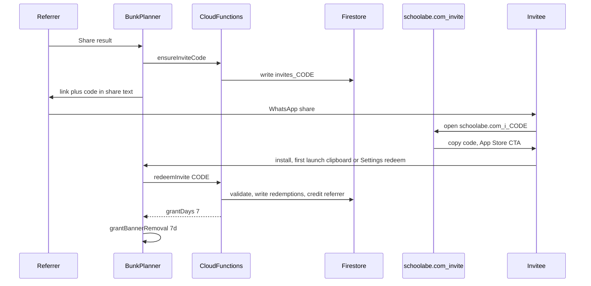

# Firebase Viral Referral Loop

**Status:** Backlog — implement in a future release (not current sprint).  
**Source plan:** Cursor plan `firebase_viral_referral` (Jul 2026).  
**Choice locked:** Option B — Firebase backend (not Branch, not offline-only codes).

**Overview:** Build a measurable invite loop with Firebase Auth (anonymous), Firestore, Cloud Functions, and a Hosting landing page. Shareable invite links credit both users with 7 days ad-free when a friend installs and redeems.

**Reward:** Both referrer and invitee get **7 days ad-free** via `AdEntitlementsStore.grantBannerRemoval`. No Pro IAP giveaway.

**Deferred install reality:** Apple has no free deferred deep link API. Use a Hosting landing page + clipboard handoff + optional Universal Links for already-installed users. Attribution is proven when the invitee **redeems**.



---

## Implementation todos

- [ ] Enable Auth/Firestore/Functions/Hosting; implement `ensureInviteCode`, `redeemInvite`, `claimReferralRewards` + `/i/:code` landing
- [ ] Add Firebase Auth/Firestore/Functions SPM + `ReferralService` (sign-in, share code, redeem, claim rewards)
- [ ] Update `shareMessage` with invite URL; Settings Invite section; clipboard/`onOpenURL` redeem; extend ad-free grant
- [ ] Add `invite_*` analytics events; update Privacy Policy for referral data

---

## Architecture

| Piece | Role |
|-------|------|
| **Firebase Auth Anonymous** | Stable `uid` per install (alongside analytics `userId`) |
| **Firestore** | `invites/{code}` → ownerUid, createdAt, redeemCount; `redemptions/{inviteeUid}` → code, at; `users/{uid}` → inviteCode, referralCredits |
| **Cloud Functions** | `ensureInviteCode`, `redeemInvite` (validation server-side) |
| **Firebase Hosting** | `https://schoolabe.com/i/{code}` → copy code, App Store id `6761951427` |
| **iOS app** | Share link, redeem UI, `onOpenURL`, clipboard scan, grant ads |

**Anti-fraud (in Functions):**

- Cannot redeem own code
- One redemption per `inviteeUid` ever
- Cap successful referrals per referrer (e.g. **10 / 30 days**)
- Code = 6-char Crockford base32 from uid hash

---

## Backend (`functions/` + Hosting)

1. Enable in Firebase console (project `bunk-planner-2935b`): Auth Anonymous, Firestore, Functions, Hosting.
2. Cloud Functions (Node 20):
   - `ensureInviteCode(uid)` → `{ code, url }`
   - `redeemInvite({ code, inviteeUid })` → validate, write redemption, credit referrer, return `{ grantDays: 7 }` for invitee
3. Referrer credit: write `users/{referrerUid}.pendingAdFreeDays += 7`. App calls `claimReferralRewards` on launch / Settings to apply via `grantBannerRemoval`.
4. Hosting `/i/:code` — brand, copy code, Open App Store CTA.
5. Later: Universal Links (`applinks:schoolabe.com`) after Hosting works.

---

## iOS app

**SPM:** `FirebaseAuth`, `FirebaseFirestore`, `FirebaseFunctions`.

**New files:**

- `Student Attendance Predictor/Services/Referral/ReferralService.swift`
- `Student Attendance Predictor/Views/Referral/RedeemInviteView.swift`
- Optional `InviteClipboardDetector` after onboarding

**Share copy** (`HomeView.shareMessage`):

```text
I can bunk N classes safely
Try Bunk Planner: https://schoolabe.com/i/ABC123
(Use code ABC123 if the link doesn’t open)
```

**Settings:** “Invite friends” — code, copy link, redeem, “X friends joined · Y days ad-free earned”.

**App entry:** `.onOpenURL` for `https://schoolabe.com/i/...` and `bunkplanner://invite/CODE`.

**Entitlements:** `extendBannerRemoval` (or equivalent) for 7 × 24h grants that stack cleanly.

**Analytics:** `invite_link_shared`, `invite_redeem_started`, `invite_redeem_succeeded`, `invite_redeem_failed(reason)`, `referral_reward_claimed(days)`.

**Privacy:** update `PrivacyPolicyView` for anonymous Auth/Firestore invite data.

---

## Out of scope

- Branch / AppsFlyer
- Free Pro IAP
- Push win-back campaigns
- Perfect SKAdNetwork viral attribution

---

## Verification

1. Deploy Functions + Hosting.
2. Device A: share → link has code; Firestore `invites/{code}` exists.
3. Device B: landing → install → redeem → 7d ads off; Device A claim → 7d ads off.
4. Reject self-redeem, second redeem, over cap.
5. Analytics `invite_*` funnel visible.
